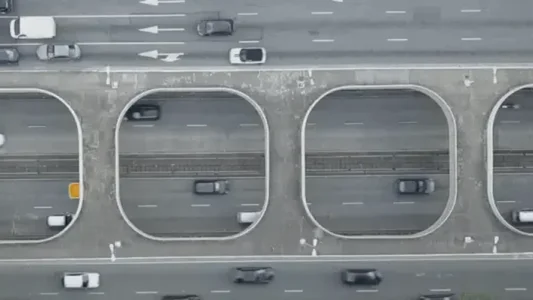
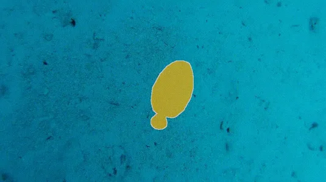
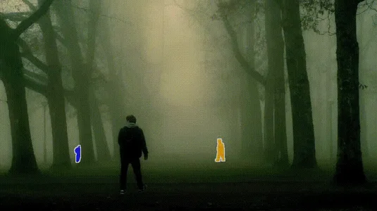

# MOSE: Complex Video Object Segmentation Dataset

## Quick Links

**🔥 MOSEv2: A More Challenging Dataset for Video Object Segmentation in Complex Scenes** 


> If you want to test your VOS model's performance in real-world complex scenarios, MOSEv2 is the right choice. Here are some cases from MOSEv2.
<div align="center">
  
  
  
  
  
</div>

<div align="center">
  
  
  
  
  
</div>

- [⬇️ Download Dataset](#mosev2-dataset)
- [🏠 Homepage](https://mose.video)
- [📄 MOSEv2 Paper (arXiv)](https://arxiv.org/abs/2508.05630)
- [🏆 Evaluation Server](https://www.codabench.org/competitions/10062/)
- [🤖 Baseline Model: RCMS](MOSEv2)
- [⬇️ Download Baseline Model](https://huggingface.co/FudanCVL/MOSEv2_baseline)

MOSEv1: A New Dataset for Video Object Segmentation in Complex Scenes
- [⬇️ Download Dataset](#mosev1-dataset)
- [🏠 Homepage](https://mose.video/MOSEv1/)
- [📄 MOSEv1 Paper (ICCV 2023)](https://arxiv.org/abs/2302.01872)
- [🏆 Evaluation Server](https://codalab.lisn.upsaclay.fr/competitions/10703)

## News

- [2025/08/07] **MOSEv2** dataset has been released! 🔥🎉🚀✨🎊🌟💫🎈
- [2023/02/09] MOSEv1 dataset has been released!

## Download

### MOSEv2 Dataset
- 🤗 [Hugging Face](https://huggingface.co/datasets/FudanCVL/MOSEv2)
- ☁️ [Baidu Pan](https://pan.baidu.com/s/1QWzovOubI0Uvr2gEQChy7Q?pwd=p2m6) (pwd: p2m6)
- ☁️ [Google Drive](https://drive.google.com/drive/folders/1tb6duuZPrjfuHVvJLcWXItsqde3fup4n?usp=drive_link)
- ☁️ [OneDrive](https://1drv.ms/f/c/c2b61e01a0e33ea5/EvcaVXmxT0FCvkZOOa2fXvEBCwEhhwlNJt5jDdM2LMV59w?e=xSLFTf)

### MOSEv1 Dataset
 - 🤗 [Hugging Face](https://huggingface.co/datasets/FudanCVL/MOSE)
 - ☁️ [OneDrive](https://entuedu-my.sharepoint.com/:f:/g/personal/liuc0058_e_ntu_edu_sg/EjXSfDF7QEZApAVpFJ5rfdABkHCf0k2Va6VDfUy7rpabNw?e=9BVkrz)
 - ☁️ [Google Drive](https://drive.google.com/drive/folders/1vChKHzbboP1k6wd6t95guxxURW3nIXBe?usp=sharing)
 - ☁️ [Baidu Pan](https://pan.baidu.com/s/116p3tQsUqObem8G8FOJ7cA) (pwd: MOSE)


## File Structure

The dataset follows a similar structure as [DAVIS](https://davischallenge.org/) and [Youtube-VOS](https://youtube-vos.org/). The dataset consists of two parts: `JPEGImages` which holds the frame images, and `Annotations` which contains the corresponding segmentation masks. The frame images are numbered using five-digit numbers. Annotations are saved in color-pattlate mode PNGs like DAVIS.

Please note that while annotations for all frames in the training set are provided, annotations for the validation set will only include the first frame.

```
<train/valid.tar>
│
├── Annotations
│ │ 
│ ├── <video_name_1>
│ │ ├── 00000.png
│ │ ├── 00001.png
│ │ └── ...
│ │ 
│ ├── <video_name_2>
│ │ ├── 00000.png
│ │ ├── 00001.png
│ │ └── ...
│ │ 
│ ├── <video_name_...>
│ 
└── JPEGImages
  │ 
  ├── <video_name_1>
  │ ├── 00000.jpg
  │ ├── 00001.jpg
  │ └── ...
  │ 
  ├── <video_name_2>
  │ ├── 00000.jpg
  │ ├── 00001.jpg
  │ └── ...
  │ 
  └── <video_name_...>

```

## BibTeX
Please consider to cite MOSE if it helps your research.

```latex
@article{MOSEv2,
    title={{MOSEv2}: A More Challenging Dataset for Video Object Segmentation in Complex Scenes},
    author={Ding, Henghui and Ying, Kaining and Liu, Chang and He, Shuting and Jiang, Xudong and Jiang, Yu-Gang and Torr, Philip HS and Bai, Song},
    journal={arXiv preprint arXiv:2508.05630},
    year={2025}
}

@inproceedings{MOSE,
  title={{MOSE}: A New Dataset for Video Object Segmentation in Complex Scenes},
  author={Ding, Henghui and Liu, Chang and He, Shuting and Jiang, Xudong and Torr, Philip HS and Bai, Song},
  booktitle={ICCV},
  year={2023}
}
```

## License
MOSE is licensed under a [CC BY-NC-SA 4.0](https://creativecommons.org/licenses/by-nc-sa/4.0/) License. The data of MOSE is released for non-commercial research purpose only.
